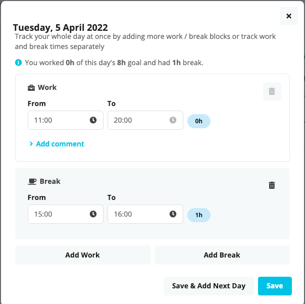

# personio-time-dialog-filler
A web extension to fill in random times into the personio form dialog
Works on Firefox and Chromium based browsers.

## What does it do?
When the plugin icon, it fills in the dialog with times form, as seen as in the screenshot below.

## How does it fill the fields?
There's two configurable (in config.js) ways :
1. Either with a fixed work start time
2. Or with a random work start time

Then it fills the rest of starts and ends of work/break according to that initial work start time
## How to configurate it with config.js:
All the values in config.js are in hours following a 24h format 
All values are self explanatory.
For `FIXED_STARTING_TIME `: You can have this as fixed starting time, If this is undefined or unset, the extension will get a random work start hour between     EARLIEST_RANDOM_STARTING_TIME and LATEST_STARTING_TIME
## TODO
- Fix issue that forces you to cycle the focus though the 4 fields to 'validate' them, I just tap tab multiple times
- Take the config to a UI
- Make the whole month automatized
